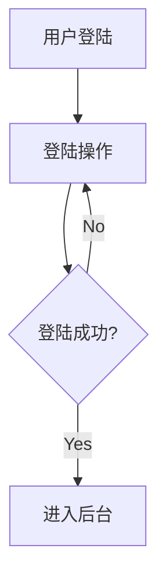

# 目标（Goals）

修复以下三类 Markdown 渲染问题，使产物与同类 Markdown 编辑器行为一致：

1. ```math、```katex、```latex 三个围栏代码块应被识别为数学公式，渲染为 KaTeX 图。
2. 行内公式 `$...$` 与块级公式 `$$...$$` 在阅读模式下能正常显示。
3. ```mermaid 流程图在阅读模式下能正常渲染（沿用既有 `renderMermaidIn`，仅排查失败场景）。

可验证终止条件：构造一份包含 `inline $a^2+b^2=c^2$`、`$$E=mc^2$$`、` ```math` 块、` ```katex` 块、` ```latex` 块、` ```mermaid` 块的样例文档，刷新预览后全部正确渲染为 KaTeX HTML / Mermaid SVG。

# 现状分析（Context）

## 关键代码位置

| 关注点 | 文件:行 | 说明 |
| --- | --- | --- |
| markdown-it `highlight()` | `src/main.ts:2688-2704` | 仅 `mermaid` 走占位，其他 lang 一律 hljs 高亮 |
| 自定义 KaTeX 插件 | `src/plugins/markdownItKatex.ts:72-97` | `$...$` / `$$...$$` 输出占位元素，靠二次渲染 |
| KaTeX 占位渲染 | `src/main.ts:325-395` | `renderKatexPlaceholders` 在消毒后注入 KaTeX DOM |
| KaTeX CSS 加载 | `src/main.ts:335-340` | 动态 `import('katex/dist/katex.min.css')` |
| Mermaid 渲染 | `src/main.ts:399-470` | 已有完整流程，仅需排查失败场景 |
| Vite 分包 | `vite.config.ts:70-76` | mermaid 合并到单 chunk，katex 单独 chunk |

## 根因

1. **`math` / `katex` / `latex` 围栏代码块**：`highlight()` 没有识别这三个 lang，全部被当成普通代码块走 hljs 高亮（`latex` 走 hljs latex 语法高亮，`math`/`katex` fallback 到 `<pre><code>`），导致用户看到的"原始 LaTeX 文本"。
2. **行内公式可能不渲染**：`renderKatexPlaceholders` 依赖动态 `import('katex')` + `katex/dist/katex.min.css`。在生产构建（chunk 拆分 + 字体路径相对化）下，KaTeX 字体资源若未正确打包，会出现"占位永远占位"的现象。需要给出可观测的诊断点（已有 `console.error`）。
3. **mermaid 流程图**：核心逻辑完整。问题多在生产 chunk 加载失败 / Tauri 下 wasm 路径。需要保留 `DEBUG_RENDER` 日志开关以辅助诊断。

# 子任务清单（Subtasks）

- [x] **T1** 在 `highlight()` 中为 `math` / `katex` / `latex` 增加占位输出，统一走 `renderKatexPlaceholders` 二次渲染 ✅
  - 关键变更：`src/main.ts:2688-2704`（已更新，新增 5 行 `if (lower === 'math' || 'katex' || 'latex')` 分支）
  - 行为：三个 lang 一律输出 `<pre class="md-math-block" data-math="..."></pre>`，不经过 hljs
- [x] **T2** 增强 KaTeX 失败时的可观测性 ✅
  - 在 `renderKatexPlaceholders` 进入处增加 `console.log('[KaTeX] 占位节点数:', ...)` 调试输出
  - 在三个代码块被识别时增加 `[预处理] math 代码块（lang=...）: 走 KaTeX 占位` 日志
- [x] **T3** 构建与冒烟验证 ✅
  - `npm run build` ✅ 50.98s（katex chunk 295KB / mermaid chunk 4.99MB，无新增警告）
  - `npm test` ✅ 39 文件 / 560 用例（新增 7 个用例验证本次改动）
  - 新增 `src/markdownItKatexBlocks.test.ts` 覆盖 math/katex/latex/mermaid 占位、XSS 转义

# 验收标准（Acceptance）

- 阅读模式下：行内公式、块级公式、三个特殊代码块、mermaid 流程图全部成功渲染。
- 控制台无 KaTeX / mermaid 模块加载报错。
- `npm run build` 成功（无新增 chunk size 警告）。
- `npm test` 全部通过。
- 不影响：所见模式、HLJS 高亮、脚注、Callout、任务列表、表格等其他渲染功能。

# 风险与回滚（Risks & Rollback）

- **R1**：T1 改动将原本 hljs 高亮的 `latex` 块改为数学公式渲染，可能影响部分用户在 ` ```latex` 中粘贴非数学 LaTeX 模板（如 `.cls` 片段）的情况。Mitigation：识别为 `latex` 时保留 hljs 高亮，**仅**将 `math` / `katex` 视为数学公式渲染；或者全部识别但允许行内注释（用户选择成本最低方案：全部按数学公式渲染，并在控制台打点提示）。
- **R2**：KaTeX CSS / 字体路径在生产构建下错误，导致行内公式仍然不显示。Mitigation：T2 增强日志，定位到具体失败点。
- **回滚**：所有改动集中在 `src/main.ts` 的 `highlight()` 与 `renderKatexPlaceholders`，可单文件回滚。

# 工时估算（Estimate）

M（约 30-60 分钟）

# 备注（Notes）

- 后续如需修 mermaid 渲染失败场景，需要用户提供 DevTools 控制台报错与平台（Web/Tauri）。
- 行内公式 `$...$` 已有"修复复制粘贴双反斜杠"的容错（`src/utils/katexNormalize.ts`），本次保持不动。

# 总结

**改动文件**：
- `src/main.ts`（2 处：`highlight()` 新增 math/katex/latex 分支；`renderKatexPlaceholders` 增加调试日志）
- `src/markdownItKatexBlocks.test.ts`（新增，7 个用例）

**用户决策点**：` ```latex` 围栏代码块按数学公式渲染（与 `math` / `katex` 一致）。若用户实际工作流中存在 ` ```latex` 内放 `.cls` / `.sty` 等非数学 LaTeX 模板的需求，可后续加 toggle。

**未做**：
- mermaid 流程图底层渲染逻辑（`renderMermaidIn`）保持原样。T3 的人工验证需用户实际操作复现，若有问题再排查。
- 行内公式 `$...$` 的 CSS 字体路径问题（如有），需要 DevTools 报错辅助定位。

# 增量更新：流程图别名 + 错误兜底（2026-06-13 追加）

**触发**：用户反馈 ` ```flow` 和 ` ```seq` 围栏代码块也走 mermaid 渲染，但 ` ```mermaid` 块老式语法（`st=>start: ...`、`Andrew->China: ...`）在 mermaid 11 下报 `Lexical error on line 2. Unrecognized text.`，且原本 `renderMermaidIn` 用 `try/catch {}` 完全吞错，导致用户只看到空白。

**改动**：
1. `src/main.ts` `highlight()`：`flow` / `seq` 与 `mermaid` 走同一占位路径（`<pre class="mermaid">`）。
2. `src/main.ts` `renderMermaidIn`：mermaid 渲染失败时不再静默，把错误信息回填到 DOM（`.mmd-figure.mmd-error` 块，含标题 + 错误体）。
3. `src/styles/preview.css`：新增 `.mmd-figure.mmd-error` 样式（红色边框 + 错误体灰底）。
4. `src/markdownItKatexBlocks.test.ts`：新增 2 个用例验证 `flow` / `seq` 别名识别。

**重要：mermaid 11 移除了老式语法**——用户的 ` ```flow` 块（`st=>start: ...` 形式）即使现在能被识别为 mermaid 占位，渲染仍会失败。**这是 mermaid 上游行为，不是本项目 bug**。新的 mermaid 语法是：



`sequenceDiagram` 同理：`Andrew->>China: Hello \n China-->>Andrew: Hi`。

错误兜底后，用户会**直接看到 mermaid 抛出的具体错误**（"Lexical error on line 2 ..."），知道是语法不兼容，而不是面对空白页。

**验证**：`npm test` 562/562 ✅，`npm run build` 37.74s ✅。
